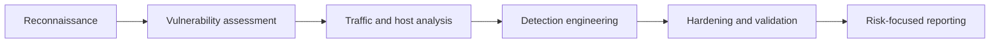

# Advanced Network Security Lab Portfolio

Hands-on defensive-security work from CIT 40600, presented as sanitized case studies spanning vulnerability discovery, system hardening, traffic analysis, threat hunting, and monitoring.

## Security workflow

## Featured case studies

| Case study | Tools | Focus |
| --- | --- | --- |
| [Vulnerability Assessment](case-studies/vulnerability-assessment.md) | Nessus, OWASP BWA | Prioritizing and communicating weaknesses |
| [Network Traffic Analysis](case-studies/network-traffic-analysis.md) | Wireshark, Tshark | Capture, filtering, and protocol analysis |
| [Threat Hunting and Monitoring](case-studies/threat-hunting-and-monitoring.md) | YARA, Snort, Security Onion, Sigma | Layered detection logic |
| [System Hardening](case-studies/system-hardening.md) | Windows policy, Linux, Lynis | Reducing attack surface |

## Skills demonstrated

- Vulnerability assessment and risk communication
- Network packet capture and protocol analysis
- Detection engineering and threat hunting
- Windows and Linux security hardening
- Security monitoring and technical reporting

## Responsible disclosure

All case studies are sanitized. Raw captures, credentials, vulnerable virtual machines, course materials, and third-party data are not included.

## How to review this portfolio

This is a documentation portfolio rather than an executable application. Start with the four case studies above and evaluate each one for objective, tools, methodology, outcome, and lessons learned. The absence of raw lab evidence is intentional and can be verified against the repository's restrictive `.gitignore` policy.

## About the author

Built by **Ahmed Balde** as a sanitized record of hands-on defensive-security work. See more cybersecurity, networking, Python, and engineering projects on [GitHub](https://github.com/fetachino).
